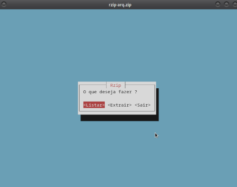
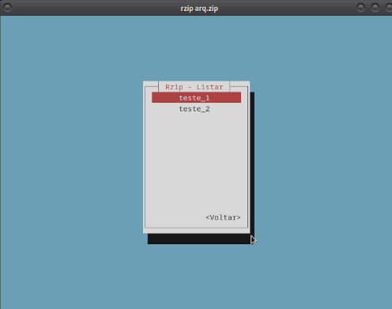

# Rzip - Listar e Extrair arquivos zip

### Programa feito em rust com a crate zip versão 2.2.2

> ⚠️ :**warning**: **Arquivos grandes**: Esse programa apresenta instabilidade com arquivos grandes, podendo causar travamentos.


# Instalação

### Para poder usar é necessário o uso do cargo
> Instalação do cargo em Linux e MacOS

```bash 
    curl --proto '=https' --tlsv1.2 https://sh.rustup.rs -sSf | sh

```

> Clonar repositório, compilar e executar
```bash 
    git clone git@github.com:matheusdefariaa/Rzip.git
    cd Rzip/
    cargo build --release
    ./target/release/rzip
```

### Tornar o software um programa padrão no Linux

```bash
	sudo chmod +x run.sh
	./run.sh
	rzip -l arq.zip
```

## Como usar:

### Para listar arquivos: 
```bash
        rzip -[l] <nome do arquivo>
```
### Para Extrair arquivos: 
```bash
        rzip -[d] <nome do arquivo>
```

### Para usar a interface no terminal: 
```bash
        rzip <nome do arquivo>
```

### Para obter ajuda: 
```bash
        rzip -[h] <nome do arquivo>
```

```bash
    println!("Autor: Matheus de Faria");
    println!("Versão: 1.1");
    println!("Data de lançamento: 15/02/2025");
```

>**Arquivo de teste:** arq.zip contém dois arquivos de texto vazios chamados de teste_1 e teste_2

### Imagens da interface:


